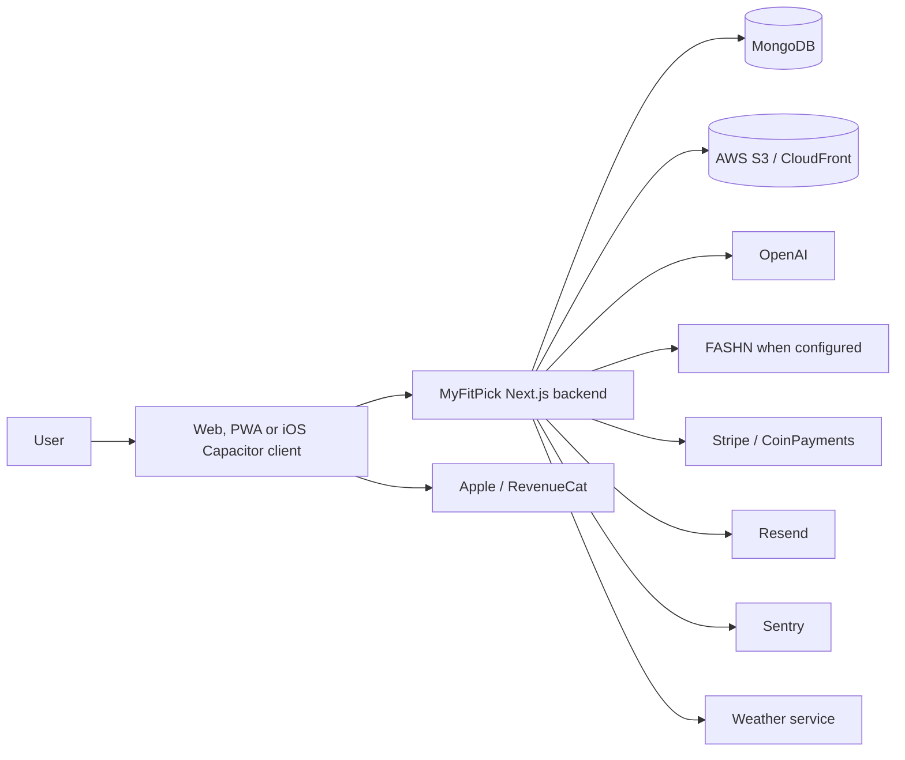

# MyFitPick Data Flow and System Processing Map

**Internal technical/legal map — August 4, 2026**

Plain-text equivalent: User → MyFitPick client → MyFitPick backend → database/object storage/AI/Virtual Try-On/payment/email/error-monitoring/weather services; iOS purchase events flow through Apple and RevenueCat back to MyFitPick.

## Flow register

| Initiating feature | Data | Destination and purpose | Return/storage | Security evidence | Retention/deletion/legal issue | Code evidence |
|---|---|---|---|---|---|---|
| Registration/sign-in | Name, email, OTP/password material, IP, user agent | Backend, MongoDB and Resend for authentication | User/session, hashed OTP and audit records | HTTP-only cookie, hashed OTP, rate limits | Session 30 days; OTP TTL; general auth/audit retention unknown | auth routes, `EmailOtp`, `User`, `lib/cookies.ts` |
| Wardrobe upload | Images, purpose, MIME, size and metadata | Backend → S3/CloudFront; OpenAI for analysis/OCR where invoked | Storage URLs/keys, normalized image, inferred metadata in MongoDB | Auth/ownership, upload validation, normalized formats | Wardrobe record delete does not prove S3 deletion | upload routes, storage, image policy, wardrobe models |
| Inspiration Match | Reference image and analysis context | S3 and OpenAI; recommendation engine | Reference record, analysis, selected closet outfit | User scoping and validation | Expiry/cleanup fields exist; execution and provider deletion need verification | reference routes/model, reference AI, matching engine |
| Stylist/Create | Prompt, wardrobe, preferences, occasion/weather/history | Backend/recommendation logic and OpenAI for stylist text/visuals | Conversation response, recommendation/history and optional image | Ownership, validation, safe logs | Conversation/history retention unknown | stylist route/modules, outfit/history models |
| Studio Model | Appearance configuration, optional measurements/model image | MongoDB, S3 and OpenAI/catalogue workflow where generated | Profile/configuration and generated/selected asset | Consent field; ownership | Sensitive-characteristic consent/retention and catalogue governance | `AvatarProfile`, Studio Model modules |
| Virtual Try-On | Model image, selected garment images, prompt/context | FASHN, OpenAI internal preview or custom provider | Generated image persisted in S3 and preview metadata in MongoDB | Provider limits, validation, cache key, safe diagnostics | Provider retention/training unknown; generated-image deletion incomplete | Try-On providers, generation, preview models |
| Credit purchase | User ID, pack, amount/currency, provider refs | Stripe, Apple/RevenueCat or optional CoinPayments | Purchase status and Credits ledger in MongoDB | Signed webhooks, unique references, reconciliation | Accounting/legal retention and deletion exceptions undefined | payment routes/providers/models |
| Support | Message, attachment, sender/read state | Backend, MongoDB and S3; Resend notification where configured | Support records and attachments | Auth, MIME/size limits, socket token | User deletion/support-message retention undefined | support routes/models/modules |
| Location/weather | Selected city/country/coordinates | MongoDB and weather service | Weather result and recommendation context | Auth and range validation | Provider identity and request retention unknown | location/weather routes/modules, `User` |
| Errors/security | Errors, route/request/device context, IP/user agent | Logs, audit database and Sentry | Diagnostics/alerts | Safe logging redacts sensitive keys; Sentry config | Scrubbing, retention and access controls unknown | safe log, audit, Sentry config |
| iOS distribution/IAP | Device/store transaction and app-user mapping | Apple and RevenueCat | Webhook event/purchase fulfilment | Auth token, unique transaction/event IDs | Store/vendor retention applies | Capacitor/iOS config, app-store provider/webhook |

## Assumptions Made

All external communications use HTTPS in production; this must be verified at infrastructure level.

## Missing Information Required from MyFitPick

Production topology, vendor regions, weather vendor, backup/cache flows, log destinations, encryption and deletion orchestration.

## Legal Review Notes

Complete Quebec and sensitive-image PIAs against the verified production map.

## Recommended Updates Before Production Use

Maintain this map through architecture change review and link every data store to retention/deletion controls.

## Codebase Evidence Reviewed

Core routes, models, provider/storage/email/payment adapters, mobile configuration and environment-name documentation.

## Document Status

Internal draft; infrastructure and legal verification required.
