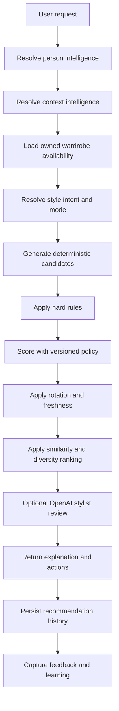

# MyFitPick Progressive Intelligence Audit

Date: 2026-07-21

## Product direction

MyFitPick should feel like a personal stylist that earns more context over time. The app should not ask for heavyweight setup, sensitive data, location access, or full-body photos before the user understands the value.

The product model after this phase is:

- Email OTP account entry remains the first gate.
- First-run setup captures only lightweight style preferences and optional usual dressing city.
- Wardrobe recommendations work from verified closet items without OpenAI, FASHN, or avatar setup.
- Virtual try-on asks for model image and consent only when the user requests an on-model preview.
- Weather context is optional and appears when weather-aware styling is useful.
- Recommendation history is tracked separately from final wardrobe data so freshness, diversity, and repeat avoidance can improve without rewriting old outfits.

## Current audit findings

- The previous onboarding flow required avatar/full-body setup too early. That blocked normal product entry and overloaded the first session.
- The avatar page already contains the full-body upload, generated model image, measurements, consent, pose, and visualization controls. It is the correct progressive entry point for try-on setup.
- The recommendation engine already used owned wardrobe items, occasion, weather, color, formality, wardrobe completeness, style profile, and fashion memory. It needed stronger history-level rotation, diversity, and user-facing freshness language.
- Stylist chat already persisted recommendations for visualization. It now needs to treat deterministic recommendations as grounded candidates and use AI only for stylist reasoning and copy.
- Weather styling had a home prompt but pointed users back to old model onboarding. Preferences now contains the city/country selector needed by that prompt.

## Current user journey map

1. Signed-out users enter through `/login` or `/register` with email OTP.
2. Authenticated users without first-run completion can visit onboarding.
3. The previous onboarding path mixed style setup, location, avatar details, consent, and full-body upload.
4. Users then build a closet through the intelligent upload flow.
5. Outfit recommendations are requested from `/outfit`, `/occasion`, or stylist chat.
6. Saved/generated looks can be opened in full preview pages and can request virtual try-on.
7. Avatar Studio owns detailed model image, pose, measurement, and consent controls.

## Current recommendation pipeline

The application now uses this runtime path:

1. Authenticate the current user.
2. Load owned wardrobe, preferences, style profile, fashion memory, outfit history, worn looks, occasion, and weather when available.
3. Generate deterministic outfit candidates from owned wardrobe items.
4. Apply hard availability and condition checks.
5. Score candidates with versioned deterministic weights.
6. Apply rotation, freshness, similarity, and diversity ranking.
7. Return a grounded recommendation, alternatives, user-safe explanations, completeness warnings, and optional gap insight.
8. Persist recommendation metadata and history events.
9. Let OpenAI, when used by stylist chat, review/explain grounded candidates rather than inventing wardrobe truth.

## Friction analysis

- Too early: full-body photo, avatar body choices, measurement fields, and preview consent were previously part of first-run setup.
- Too early: live location permission was offered before the user had asked for weather-aware styling.
- Too late: weather city editing was not available at the destination linked from the home weather card.
- Duplicate setup: onboarding and Avatar Studio both handled model image setup.
- Blocked unnecessarily: ordinary recommendations could be blocked by avatar setup despite not needing a model photo.
- Under-contextual recommendations: rotation and history were not strong enough to prevent repeated top-scoring combinations.

## Features asking for information too early

- Avatar base, body shape, measurements, full-body photo, model image consent, live location, future calendar, notifications, travel details, shopping preferences, and brand/budget preferences should not appear during account creation or first-run style start.

## Features asking too late

- Weather city should be offered when weather styling is requested.
- Try-on model setup should appear exactly when the user asks for virtual try-on.
- Rejection feedback and swap reasons should be collected at the outfit interaction point.
- Wardrobe gap preferences should appear after a real gap insight exists.

## Recommendation repetition analysis

- The previous top-sort behavior could repeatedly select the same highest-scoring pieces.
- Repetition is sometimes correct when the wardrobe is small, but it should be explained honestly.
- Exact duplicate outfits now receive a history penalty and are removed from diversity ranking.
- Recently recommended or worn items receive soft penalties, while long-unused suitable items receive freshness credit.
- Freshness never overrides occasion, weather, or completeness suitability.

## Data model changes

`OutfitHistory` is additive and safe to roll out without migrating old records. It records recommendation lifecycle events such as generated, saved, rejected, swapped, worn, and virtual try-on generated.

`OutfitRecommendation` received additive fields for recommendation mode, style intent, freshness cue, wardrobe readiness, gap insights, scoring metadata, similarity metadata, candidate counts, and alternatives.

`WardrobeItem` received additive usage intelligence fields: `timesWorn`, `recommendationCount`, `lastRecommendedAt`, `favoriteScore`, `versatilityScore`, and `confidenceScore`.

No destructive migration is required. Existing wardrobe items and outfits will keep working with null/default values until they accumulate history.

## Recommendation architecture

The deterministic engine now runs in this order:

1. Load only the current user's owned wardrobe items.
2. Prefer verified metadata where available.
3. Infer occasion structure and wardrobe readiness.
4. Generate owned-item candidate combinations with a bounded candidate cap.
5. Score each candidate by category validity, occasion fit, dress code, weather, season, color harmony, silhouette, material compatibility, style profile, memory, rotation, freshness, comfort, and luxury aesthetic.
6. Diversify candidates against recent history so exact repeats are avoided when viable alternatives exist.
7. Return user-safe explanations, freshness cues, gap insights, and alternatives without exposing internal scoring math.

## Target architecture

## Progressive triggers

The first trigger foundation includes:

- `FIRST_VIRTUAL_TRYON_MODEL_REQUIRED`: shown only when try-on is requested without a model image or consent.
- `WEATHER_VALUE_DISCOVERED`: used when weather-aware context is requested without a saved city.
- Additional placeholders for calendar, travel, wardrobe gap, unused item rotation, low style confidence, full-body photo, and notifications.

The trigger objects are structured so future UI can render modals, bottom sheets, or inline prompts without changing business logic.

## UX changes

- Onboarding now asks for display name, style words, favorite colors, colors to use less often, comfort, formality, repeat sensitivity, and optional city/country.
- Onboarding no longer asks for full-body photo, avatar body setup, measurements, geolocation permission, or try-on consent.
- The home weather card points to Profile Preferences, where the user can add city/country.
- Outfit notes now show style intent, freshness, and one closet insight in plain language.
- Try-on setup-required errors now guide the user to set up the try-on model instead of looking like a broken preview.

## Rollout plan

- Deploy as an additive schema release.
- Do not backfill historical outfit history initially.
- Let new recommendations populate `OutfitHistory` naturally.
- Monitor recommendation generation latency and candidate counts.
- Add a backfill only if analytics need old saved/worn looks in the freshness model.

## Phased implementation plan

1. Phase 1: audit, additive models, recommendation memory, avatar setup relocation.
2. Phase 2: deterministic scoring, rotation, freshness, diversity, small wardrobe messaging.
3. Phase 3: OpenAI stylist ranking, explanation refinement, feedback learning weights.
4. Phase 4: progressive prompt cooldowns, weather prompts, calendar, travel, notifications.
5. Phase 5: advanced analytics, shopping intelligence, proactive stylist conversations.

## Migration plan

- No automatic destructive migration.
- Existing users keep their current `modelSetupCompletedAt` values.
- Existing avatar profiles and uploaded/generated model images remain reusable for first try-on.
- Existing outfit records serialize with defaults for new fields such as `freshnessCue`, `wardrobeReadiness`, and `alternatives`.
- New `OutfitHistory` records are created only as users generate, save, reject, swap, wear, or preview looks after deployment.
- Production can optionally backfill `OutfitHistory` from saved/worn looks later if analytics need it.

## Rollback plan

- Revert the additive recommendation engine imports and route history writes if recommendation latency or ranking quality regresses.
- Keep new MongoDB fields/collections in place during rollback; they are additive and harmless when unused.
- Revert onboarding to a simpler style form if UX issues appear, but do not reintroduce mandatory full-body setup outside try-on.
- Disable future progressive prompts behind feature flags before removing data.

## Success metrics

- Onboarding completion rate.
- Time to first wardrobe item.
- Time to first recommendation.
- First recommendation acceptance rate.
- Exact and near-duplicate recommendation rate.
- Wardrobe utilisation.
- Saved looks and worn recommendations.
- Swap usage and rejection reasons.
- Try-on activation and model setup completion after try-on intent.
- Weather city opt-in after weather value is shown.
- Seven-day and thirty-day retention.

## Observability and cache notes

- Recommendation responses now persist candidate counts, diversity counts, score breakdown, similarity metadata, and recommendation mode for debugging.
- The route accepts a `traceId` input path through the engine, but full trace propagation remains a future observability task.
- No recommendation cache was added in this phase. Future cache keys should include user ID, wardrobe version, style profile version, context hash, mode, history version, scoring version, and prompt version.

## Privacy and consent notes

- Full-body image and preview consent remain in Avatar Studio and are required only for virtual try-on.
- Core outfit recommendations continue to work without body image, calendar, notification permission, or live location.
- Weather city is manual and optional; no browser geolocation is requested during onboarding.
- History records store wardrobe item references and event metadata, not private image URLs or raw body data.

## Remaining limitations

- Progressive prompt frequency state exists as a model foundation, but prompt suppression/cooldown UI is not fully wired yet.
- Smart swap still uses route-level replacement logic and can be made more score-aware in a later pass.
- Weather city uses a curated country/city list plus custom fallback, not a full geocoding provider.
- Style confidence is not yet surfaced as a visible confidence meter.
- Recommendation tests are deterministic unit-style checks; full browser QA still needs authenticated manual testing.
